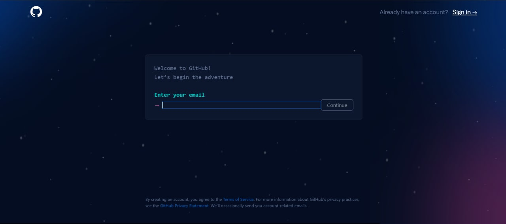

# **2. Основы Git и GitHub**
- [Понятия **Git** и **GitHub**](#21-понятия-git-и-github)
- [Установка **Git**](#22-установка-git)
- [Регистрация на **GitHub**](#регистрация-на-github)

### **2.1 Понятия Git и GitHub**

___

Как мы выяснили в [предыдущем параграфе](paragraph_1.md), **Git** - это консольная утилита, для отслеживания и ведения истории изменения файлов, в вашем проекте. 
**Github** же позволяет делать то же самое, но уже удаленно, что помогает настраивать взаимодействие между сотрудниками одной команды.

> **GitHub** — крупнейший веб-сервис для хостинга IT-проектов и их совместной разработки. Веб-сервис основан на системе контроля версий Git и разработан на Ruby on Rails и Erlang компанией GitHub, Inc.


&nbsp;

______

### **2.2 Установка Git**
Основой интерфейс для работы с Git-ом является консоль/терминал. Это не совсем удобно, тем более для новичков, поэтому рекомендуется поставить дополнительную программу с графическим интерфейсом. 

&nbsp;


***Варианты установки Git***:


| Операционная система | Способ установки |
| ---- | ---- |
| Windows | Требуется перейти по [ссылке](https://git-scm.com/download/win), выбрав вашу версию ОС, и далее совершить установку. |
Mac OS с Homebrew | Требуется прописать в терминале ``` brew install git``` |
| Mac OS без Homebrew | Требуется прописать в терминале `git --version`. После этого появится окно, где предложит установить Command Line Tools (CLT). |
| Linux | Требуется прописать в терминале `sudo apt install git` |


&nbsp;


### **2.3 Регистрация на GitHub:**
1. Перейдите по [ссылке](https://github.com/)
2. Далее нажмите на выделенную кнопку *sign up*

3. После этого у вас откроется окно, где нужно будет ввести данные

4. Завершите регистрацию, следуя рекомендациям

---

Ваша шкала прогресса после прочтения
> 
_____

&nbsp;

***Навигация***

[◀️Предыдущая страница](paragraph_1.md) | [Главная страница](readme.md) | [Следующая страница▶️](paragraph_3.md)
