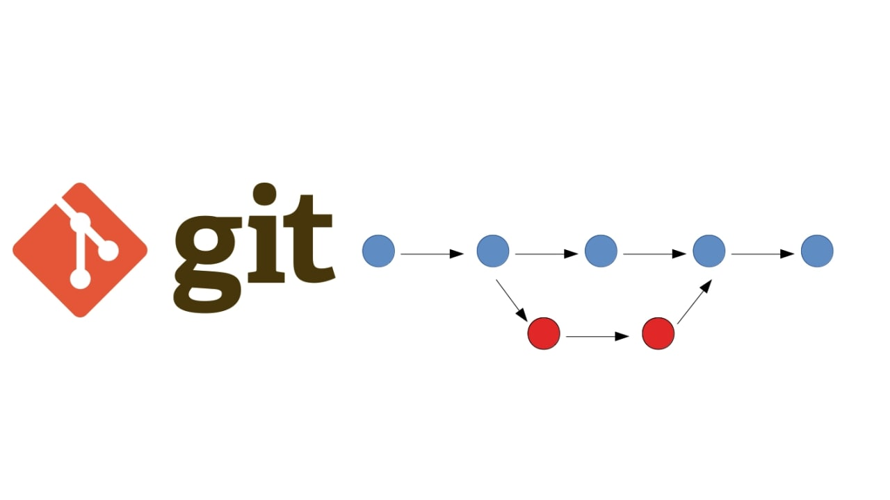
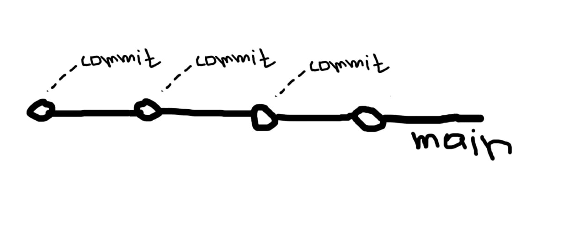
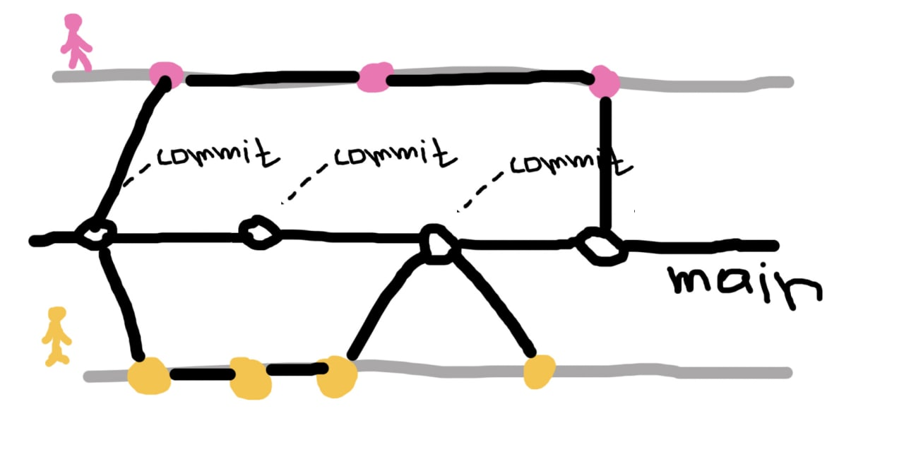
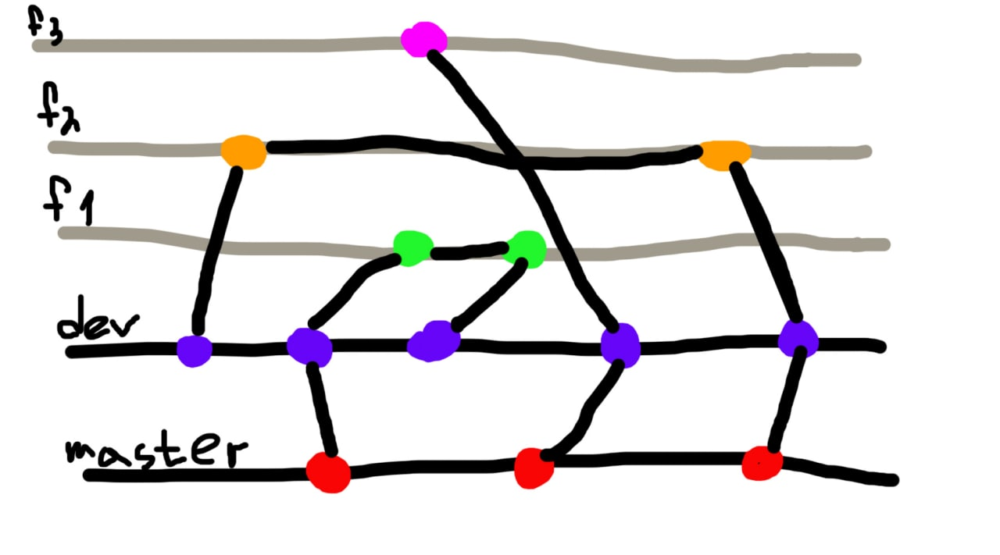
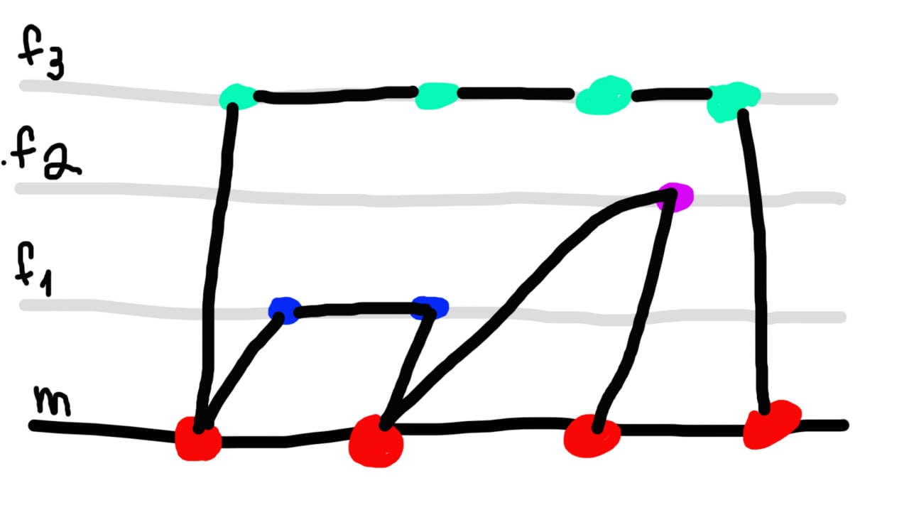

# **3. Ветвление: основные понятия и виды**

___
## **Основные понятия**

&nbsp;

**Ветка** - это последовательность созданных коммитов.

> **Коммит** - это это снимок ваших локальных файлов, записанный в локальный репозиторий.

Можно представить **ветку** как временную школу, на которой отображаются те моменты, которые мы сохранили - **коммитов**

Схематически представление ветки можно увидеть на изображении ниже

&nbsp;

-----

## **Виды ветвления:**

> **Central Workflow** - данный вид ветвления подходит для одиночных проектов, где основным разработчиком является один человек, который разрабатывает и контролирует проект. 

----
> **Developer Branch Workflow** - подобный вид подойдет, если вы работаете небольшой командой в несколько человек, где не требуется строгий контроль. Для каждого сотрудника создается отдельная ветвь, в которой он совершает основные действия. 

----
> **Feature Branch Workflow** - для такого вида работы уже происходит контроль за конечным продуктом. Репозиторий имеет второстепенную ветку, куда направляются обновления с функциональной ветки

____
> **Issue Branch Workflow** - такой вид контроля очень похож на предыдущий, но ветки, с которых сливается информация в **dev**, создаются под определенные задачи или проблемы, а не под фичи, как в предыдущем варианте
----
> **Forking Workflow** - подходит для проектов с открытым исходным кодом. Для таких проектов создается копия оригинального репозитория, где происходят все изменения.
-----
> **Github flow** - подобный вид подойдет учебным командам, либо достаточно гибким проектам. В таком случае у нас будет главная ветка с работоспособным кодом, а также отдельные ветки, где происходят все изменения. После изменений ответственный сотрудник проверяет корректность и публикует изменения в главной ветке.

-----------
Ваша шкала прогресса после прочтения
> 
---------

&nbsp;

***Навигация***

[◀️Предыдущая страница](paragraph_2.md) | [Главная страница](readme.md) | [Следующая страница▶️](paragraph_4.md)