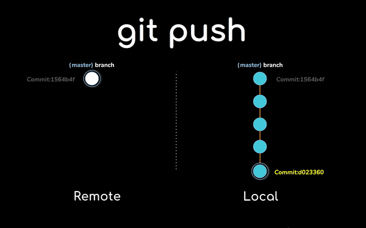

# **4. Синтаксис**


________________

&nbsp;

Работая впервые, вам потребуется указать ваши данные через команду
> `git config`

Так вы сможете указать ваше имя и вашу почту
```
git config --global user.name "Your Name"
git config --global user.email "your_email@whatever.com"
```
-------------------
> `get init` 

C помощью данной команды вы создаете репозиторий.
```
get init
```
---------
> `git add`

```
git add [ИМЯ]
```
Чтобы добавить определенный файл в индекс
```
git add .
```
Добавляет все файлы в индекс, кроме тех, что вы игнорируете.

---------
> `git commit`

Команда создает точку сохранения - коммит, о чем мы говорили в [предыдущей статье](paragraph_3.md).

С помощью данной комманды мы можем оставить комментарий для других коллег нашей команды. Делается это добавлением `-m` в конце команды, а также самого комментария после. Полная команда будет выглядеть так:
```
git commit - m "комментарий"
````
--------------
> `git clone`

Из самой команды можно монять, что с ее помощью мы можем сделать копию существующего репозитория

```
git clone
````
-----------
> `git remote add` 

C помощью команды вы можете ***связать*** локальный и удаленный репозиторий

````
git remote add [имя_удаленного_репозитория] [ссылка]
````

--------------
> `git fetch`

Через данную команду вы можете получить все изменения, которые были внесены на удаленном репозитории. Важно учесть, что изменения в код не вносятся
> `git merge`

C помощью данной команды, вы уже можете внести все изменения, которые были сделаны в удаленном репозитории, в код.

> `git pull` 

Объединяет под собой две предыдущие команды. 

```
git pull
```
-------------
> `git push`

Выполняет обновление, которые вы внесли, в удаленный репозиторий. 


-----------

> `git status`

Позволяет вывести все изменения в репозитории. 

---------
> `git log`

Аналогично команда отобразит все коммиты, которые были созданы, а также их хеш. С помощью хешей можно отслежить информацию по определенным коммитам

-----------
> `git show` ***[хеш]***

Показывает изменения по определенному коммиту, хеш которого мы указали

----------
Ваша шкала прогресса после прочтения
> 
-----------

&nbsp;


***Навигация***

[◀️Предыдущая страница](paragraph_3.md) | [Главная страница](readme.md) | [Следующая страница▶️](paragraph_5.md)