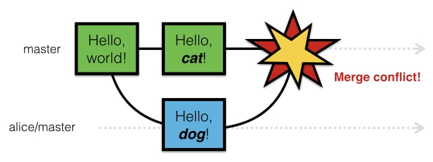

# **5. Конфликты**

_____

Работая в команде над крупным проектом, разработчики достаточно часто встречаются с конфликтом
> **Конфликт** - это ошибка в Git при попытке слияния кода, которые был отредактирован разными разработчиками в одно и то же время
-------------

&nbsp;

## **Решение конфликтов**
Зачастую требуется вручную проверять код в месте конфликта, после чего уже **коммитить** корректный код. 

На данный момент достаточно много IDE могут помочь в решении конфликтов, но также рекомендуется **выполнять некоторые рекомендации, чтобы избежать конфликтов.**

-------

1. Распределение ресурсов таким образом, чтобы рабочие зоны кода не пересекались одновременно
2. Всегда проверяйте актуальность кода. Если код был изменен - вытащите обновление
3. Создайте ***.editorconfig***, чтобы конфликты не возникали из-за различных IDE

&nbsp;

___
Ваша шкала прогресса после прочтения
> 
-----------

&nbsp;

***Навигация***

[◀️Предыдущая страница](paragraph_4.md) | [Главная страница](readme.md) | [Следующая страница▶️](paragraph_6.md)