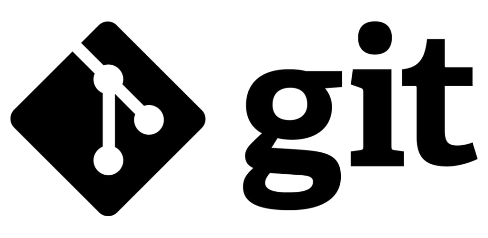

# **Культура работы в Git**



----

При оценке того, насколько рабочий процесс подходит вашей команде, очень важно принимать во внимание культуру команды. Рабочий процесс должен повышать эффективность работы команды, а не быть обузой, ограничивающей ее продуктивность.

&nbsp; 

---- 

> Написание коммитов

Как мы разбирали в [разделе 4](paragraph_4.md), коммиты можно задавать с комментарием. Напомним, что делается это через `-m`, а полный код будет выглядеть
```
git commit -m "комментарий"
```

Для того, чтобы, во-первых, вы всегда сами могли вернуться к тому или иному коммиту, а также для того, чтобы ваши коллеги могли отслеживать причину создания коммита, рекомендуется оставлять краткий, но емкий комментарий, характеризующий изменения, которые вы внесли в код. 

--------
> Избежание конфликтов

[В предыдущий главе](/paragraph_5.md) мы рассмотрели основные вохможности избежать конфликтов. Работая в большой команде, мы, к сожалению, не сможем избежать их вовсе, но сможет минимизировать, чтобы существенно облегчит работу всей команды. 

------

Ваша шкала прогресса после прочтения
> 
-----------

&nbsp;


***Навигация***

[◀️Предыдущая страница](paragraph_6.md) | [Главная страница](readme.md) | [Следующая страница▶️](end.md)